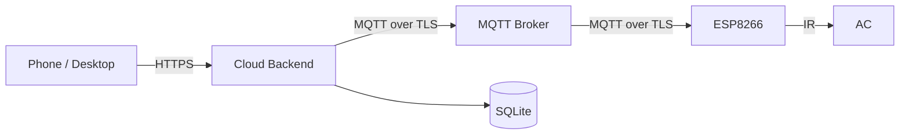

**English** | [简体中文](./README.md)

<p align="center">
  
</p>

<h1 align="center">Remote AC Controller</h1>
<p align="center"><strong>Full-stack open-source AC remote control</strong></p>

<p align="center">
  <a href="https://github.com/nobodycareme/remote-ac-controller/actions/workflows/ci.yml"></a>
  <a href="./LICENSE"></a>
  <a href="https://github.com/nobodycareme/remote-ac-controller/releases"></a>
  <a href="#quick-start"></a>
  <a href="#quick-start"></a>
</p>

<p align="center">
  <a href="#quick-start">Quick Start</a> ·
  <a href="./docs/English/README.md">Documentation</a> ·
  <a href="./docs/中文/文档导航.md">中文</a> ·
  <a href="#hardware">Hardware</a> ·
  <a href="#license">License</a>
</p>

---

A full-stack open-source system that controls an air conditioner remotely: phone
web app → cloud backend → MQTT (TLS) → ESP8266 → IR → AC. Firmware, cloud,
frontend, PCB, and IR learning tools are all open source — self-hostable,
extensible, and ready for your own remotes.

---

## Core features

- **Responsive remote web UI** — Vue 3 single-page app for desktop and mobile.
- **11 preset discrete IR states** — covering off, cool, dry, heat, and common
  temperature/fan/swing combinations, each independently enabled. The public
  repository ships no real AC IR frames; capture your own with the
  [IR learning tool](#ir-learning-tool).
- **Temperature & humidity monitoring** — DHT11 on GPIO5.
- **Scheduling & temperature automation** — weekly cron-style tasks with
  hysteresis-based temperature control to avoid rapid cycling.
- **Two-role access model** — Owner / Guest with trusted devices and persistent
  sessions.
- **Optional campus-network auto-authentication** — for Srun-based campus
  networks (e.g. Xidian), the device can log into the captive portal
  automatically after boot and recover after disconnects (off by default;
  see [Optional campus authentication](#optional-campus-authentication)).

## Repository contents

| Path | Contents |
|---|---|
| `firmware/` | ESP8266 firmware: `agent-platformio/` (PlatformIO / command-line workflow) and `arduino-ide/` (Arduino IDE workflow) sharing `shared/RemoteACCore/` |
| `cloud/` | `backend/` (Fastify + MQTT bridge), `frontend/` (Vue 3 web UI), `broker/`, `deploy/` |
| `hardware/` | PCB design & manufacturing files (Rev 1.0.1), wiring docs |
| `tools/` | IR learning tool, packaging and validation scripts |
| `docs/` | Full bilingual documentation (see [Documentation](#documentation)) |

## Quick start

### 1. Build the ESP8266 firmware (PlatformIO)

```powershell
cd firmware/agent-platformio
pwsh ./tools/dev.ps1 test -Profile public
pwsh ./tools/dev.ps1 verify -Profile public
pwsh ./tools/dev.ps1 build -Profile public
```

Full guide: [Arduino IDE 使用指南 (zh)](./docs/English/arduino-ide-guide.md)

### 2. Arduino IDE workflow

Open `firmware/arduino-ide/Remote_AC_Controller/Remote_AC_Controller.ino`
in Arduino IDE, follow the one-time setup in the sketch README, then compile
and upload.

### 3. Deploy backend and frontend

```bash
cd cloud/backend && npm ci && npm test
cd cloud/frontend && npm ci && npm test && npm run build
```

Complete deployment (including MQTT broker and reverse proxy):
[部署指南 (zh)](./docs/English/deployment.md)

### 4. Manufacture the PCB

Use the Gerber, drill, and flying-probe files under `hardware/pcb/fabrication/`.
The package contract and per-file hashes are in
[manufacturing-manifest](./hardware/pcb/fabrication/manufacturing-manifest.md).
**Note: the Rev 1.0 manufacturing files are superseded — do not use them.**

### 5. Use the IR learning tool

Capture IR frames from your own AC remote:
[红外学习 (zh)](./docs/English/ir-learning.md) — tool in
[`tools/ir-simple-learner/`](./tools/ir-simple-learner/).

### 6. Optional Srun campus authentication

For Srun-based campus networks (e.g. Xidian):
[西电校园网自动认证 (zh)](./docs/English/xidian-campus-network-authentication.md) and
[Srun 移植指南 (zh)](./docs/English/srun-campus-network-porting-guide.md).

## Simplified architecture



## Hardware

- Board: **NodeMCU ESP8266 development board**
- Temperature/humidity: DHT11 (GPIO5)
- IR module: ZJ-IR-V2 (GPIO12 TX / GPIO14 RX)
- PCB: Rev 1.0.1 ([PCB docs](./hardware/pcb/README.en.md), wiring in
  [接线说明 (zh)](./docs/English/wiring.md))

## Optional campus authentication

For Srun-based campus networks (e.g. Xidian), the firmware can automatically
complete the captive-portal login after boot and recover after disconnects.
This is off by default; public builds contain no credentials. See
[西电校园网自动认证 (zh)](./docs/English/xidian-campus-network-authentication.md).

## Documentation

All bilingual documentation lives under [`docs/`](docs/):
[English documentation index](./docs/English/documentation-index.md) and
[中文文档导航](./docs/中文/文档导航.md).

## Development and testing

```powershell
# Full validation
./tools/test-all.ps1
./tools/build-all.ps1

# Documentation consistency (parity, links, forbidden wording)
python tools/check-doc-parity.py
python tools/check-doc-links.py
python tools/check-doc-language-links.py
python tools/check-public-docs.py

# Version and release integrity
python tools/check-version.py
python tools/check-pcb-release.py
```

See [CONTRIBUTING.md](./CONTRIBUTING.md) before contributing.

## Contributing

Issues and pull requests are welcome. Please read
[CONTRIBUTING.md](./CONTRIBUTING.md) and the
[参与贡献指南 (zh)](./docs/English/contributing.md) first.

## Support and security

- Usage and configuration questions: check the
  [documentation index](./docs/English/documentation-index.md) first, then open
  an [Issue](https://github.com/nobodycareme/remote-ac-controller/issues).
- Security vulnerabilities: use GitHub Private Vulnerability Reporting — do not
  post them publicly ([SECURITY.md](./SECURITY.md)).

## License

Licensed under the [Apache License 2.0](./LICENSE). Third-party component
licenses are listed in [THIRD_PARTY_NOTICES.md](./THIRD_PARTY_NOTICES.md).

## Repository note

This repository is the single official open-source home of the project;
firmware, cloud, hardware, tools, and docs are all maintained here.
