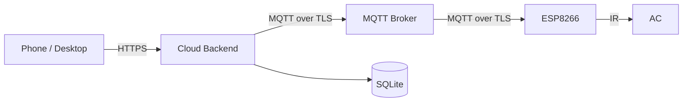

**English** | [简体中文](./README.md)

<p align="center">
  
</p>

<h1 align="center">Remote AC Controller</h1>
<p align="center"><strong>Full-stack open-source AC remote control (v1.2.2)</strong></p>

<p align="center">
  <a href="https://github.com/nobodycareme/remote-ac-controller/actions/workflows/ci.yml"></a>
  <a href="./LICENSE"></a>
  <a href="https://github.com/nobodycareme/remote-ac-controller/releases"></a>
  <a href="#quick-start"></a>
  <a href="#quick-start"></a>
</p>

<p align="center">
  [Quick Start](#quick-start) ·
  [Documentation](./docs/English/documentation-index.md) ·
  [简体中文](./README.md) ·
  [Hardware](#hardware) ·
  [License](#license)
</p>

---

A full-stack open-source system that controls an air conditioner remotely: phone
web app → cloud backend → MQTT (TLS) → ESP8266 → IR → AC. Firmware, cloud,
frontend, PCB, and IR learning tools are all open source — self-hostable,
extensible, and ready for your own remotes. **Software v1.2.2 · PCB Rev 1.0.1.**

---

## Core features

- **Responsive remote web UI** — Vue 3 single-page app for desktop and mobile.
- **10 IR capture presets** + **11 cloud-registered AC state metadata entries** —
  covering off, cool, dry, heat, and common temperature/fan/swing
  combinations, each independently enabled. The public repository ships no
  real AC IR frames; capture your own with the
  [IR learning tool](#ir-learning-tool).
- **Temperature & humidity monitoring** — DHT11 on GPIO5.
- **Scheduling & temperature automation** — weekly cron-style tasks with
  hysteresis-based temperature control to avoid rapid cycling.
- **Two-role access model** — Owner / Guest with trusted devices and persistent
  sessions.
- **Home/lab WPA Wi-Fi and Srun campus-network first-time setup** — local
  WPA/WPA2 credentials via `ENABLE_WIFI_CREDENTIALS`; campus open SSID with
  Portal login (off by default).
- **English UI, Chinese & English documentation, full bilingual stack.**

## Repository contents

| Path | Contents |
|---|---|
| `firmware/` | ESP8266 firmware: `agent-platformio/` (PlatformIO / command-line workflow) and `arduino-ide/` (Arduino IDE workflow) sharing `shared/RemoteACCore/` |
| `cloud/` | `backend/` (Fastify + MQTT bridge), `frontend/` (Vue 3 web UI), `broker/`, `deploy/` |
| `hardware/` | PCB design & manufacturing files (Rev 1.0.1), wiring docs |
| `tools/` | IR learning tool, packaging and validation scripts |
| `docs/` | Full bilingual documentation (see [Documentation](#documentation)) |

## Interface preview

<p align="center">
  
</p>

<p align="center">
  
</p>

> Demo data: device "Demo AC" / 26.0°C / 45% RH / control: cool 24°C, auto fan, dual-swing. Screenshots come from the real local frontend with synthetic demo data; no real session, credentials, or IR frames are shown.

## Quick start

<a id="quick-start"></a>

This section lists the three most common first-time paths. Every command shown here is runnable in this repository. **A home/lab Wi-Fi password** and the **Xidian Srun campus account** belong in *different* untracked secret files; they are **not interchangeable**.

### A. Home or lab WPA / WPA2 Wi-Fi

<a id="first-time-wifi"></a>

```powershell
# 1. one-time: copy the template and fill in your router SSID + password
cd firmware/shared/RemoteACCore/src/config
cp wifi_secrets.example.h wifi_secrets.h
# edit wifi_secrets.h:
#   #define LOCAL_WIFI_SSID     "your_wifi_name"
#   #define LOCAL_WIFI_PASSWORD "your_wifi_password"
```

```powershell
# 2. build and flash (auto-joins the home network at boot)
cd firmware/agent-platformio
./tools/dev.ps1 build -Profile local-wifi
# or with cloud: ./tools/dev.ps1 build -Profile local-wifi-cloud
```

Full walkthrough: [First-time setup — home Wi-Fi](./docs/English/first-time-setup.md)

### B. Xidian Srun campus network

<a id="first-time-campus"></a>

Xidian Wi-Fi is an open SSID (no WPA password); the Portal login uses your student credentials.

```powershell
# 1. one-time: copy the public Xidian example profile and the campus secrets template
cd firmware/shared/RemoteACCore/src/config
cp profiles/xidian.example.h profiles/xidian.h
# campus_secrets.h carries the Srun username / password:
#   #define CAMPUS_USERNAME "your_student_id"
#   #define CAMPUS_PASSWORD "your_campus_password"
```

```powershell
# 2. build and flash
cd firmware/agent-platformio
./tools/dev.ps1 build -Profile local-campus-example
```

Full walkthrough: [First-time setup — campus](./docs/English/first-time-setup.md) / [Xidian campus authentication](./docs/English/xidian-campus-network-authentication.md)

### C. Offline / credentials-free build

<a id="first-time-offline"></a>

Compile the local sensor / serial / read-only path with no real credentials compiled in:

```powershell
cd firmware/agent-platformio
./tools/dev.ps1 build -Profile public
# defaults: ENABLE_WIFI=1 ENABLE_CLOUD=1 ENABLE_CAMPUS_AUTH=0, no credentials compiled in
```

> Public builds never include real credentials. `wifi_secrets.h` and `campus_secrets.h` are git-ignored; only the `.example.h` templates may be committed.

### 1. Build the ESP8266 firmware (PlatformIO)

```powershell
cd firmware/agent-platformio
./tools/dev.ps1 test -Profile public
./tools/dev.ps1 verify -Profile public
./tools/dev.ps1 build -Profile public
```

Full guide: [PlatformIO firmware guide](./firmware/agent-platformio/README.en.md)

### 2. Arduino IDE workflow

Open `firmware/arduino-ide/Remote_AC_Controller/Remote_AC_Controller.ino`
in Arduino IDE, follow the one-time setup in the sketch README, then compile
and upload.

Full guide: [Arduino IDE guide](./docs/English/arduino-ide-guide.md)

### 3. Deploy backend and frontend

```bash
cd cloud/backend && npm ci && npm test
cd cloud/frontend && npm ci && npm test && npm run build
```

Complete deployment (including MQTT broker and reverse proxy):
[deployment guide](./docs/English/deployment.md)

### 4. Manufacture the PCB

Use the Gerber, drill, and flying-probe files under `hardware/pcb/fabrication/`.
The package contract and per-file hashes are in
[manufacturing-manifest](./hardware/pcb/fabrication/manufacturing-manifest.md).
**Note: the Rev 1.0 manufacturing files are superseded — do not use them.**

### 5. Use the IR learning tool

Capture IR frames from your own AC remote:
[IR learning](./docs/English/ir-learning.md) — tool in
[`tools/ir-simple-learner/`](./tools/ir-simple-learner/). Download
`IR_Simple_Learner_v4_windows_x64.exe` from the
[Releases](https://github.com/nobodycareme/remote-ac-controller/releases) page.

### 6. Optional Srun campus authentication

For Srun-based campus networks (e.g. Xidian):
[Xidian campus authentication](./docs/English/xidian-campus-network-authentication.md) and
[Srun porting guide](./docs/English/srun-campus-network-porting-guide.md).

## Simplified architecture



## Hardware

<a id="hardware"></a>

- Board: **NodeMCU ESP8266 development board**
- Temperature/humidity: DHT11 (GPIO5)
- IR module: ZJ-IR-V2 (GPIO12 TX / GPIO14 RX)
- PCB: Rev 1.0.1 ([PCB docs](./hardware/pcb/README.en.md), wiring in
  [wiring guide](./docs/English/wiring.md))

## Optional campus authentication

For Srun-based campus networks (e.g. Xidian), the firmware can automatically
complete the captive-portal login after boot and recover after disconnects.
This is off by default; public builds contain no credentials. See
[Xidian campus authentication](./docs/English/xidian-campus-network-authentication.md).

## Documentation

<a id="documentation"></a>

All bilingual documentation lives under [`docs/`](docs/):
[English documentation index](./docs/English/documentation-index.md)
([中文文档导航](./docs/中文/文档导航.md)).

| Quick start | Understand the project | Operations & troubleshooting |
|---|---|---|
| [Hardware overview](./docs/English/hardware.md) · [Wiring](./docs/English/wiring.md) · [First-time setup](./docs/English/first-time-setup.md) | [Architecture](./docs/English/architecture.md) · [Security model](./docs/English/security-model.md) | [Deployment](./docs/English/deployment.md) · [Operations guide](./docs/English/operations-guide.md) |
| [Arduino IDE guide](./docs/English/arduino-ide-guide.md) | [MQTT protocol](./docs/English/mqtt-protocol.md) · [Scheduling](./docs/English/scheduling.md) | [Troubleshooting](./docs/English/troubleshooting.md) · [Backup and recovery](./docs/English/backup-and-recovery.md) |
| [IR learning](./docs/English/ir-learning.md) | [Temperature automation](./docs/English/temperature-automation.md) | [Security policy](./SECURITY.md) · [Support](./docs/English/support.md) |

## Development and testing

```powershell
# Full validation
./tools/test-all.ps1
./tools/build-all.ps1

# Documentation consistency (parity, links, forbidden wording)
python tools/check-doc-parity.py
python tools/check-doc-links.py
python tools/check-doc-language-links.py
python tools/check-public-docs.py

# Version and release integrity
python tools/check-version.py
python tools/check-pcb-release.py
```

See [contributing guide](./docs/English/contributing.md) before contributing.

## Contributing

Issues and pull requests are welcome. Please read
[contributing guide](./docs/English/contributing.md) first.

## Support and security

- Usage and configuration questions: check the
  [documentation index](./docs/English/documentation-index.md) first, then open
  an [Issue](https://github.com/nobodycareme/remote-ac-controller/issues).
- Security vulnerabilities: use GitHub Private Vulnerability Reporting — do not
  post them publicly ([security policy](./SECURITY.md)).

## License

<a id="license"></a>

Licensed under the [Apache License 2.0](./LICENSE). Third-party component
licenses are listed in [third-party notices](./THIRD_PARTY_NOTICES.md).

## Repository note

This repository is the single official open-source home of the project;
firmware, cloud, hardware, tools, and docs are all maintained here.
