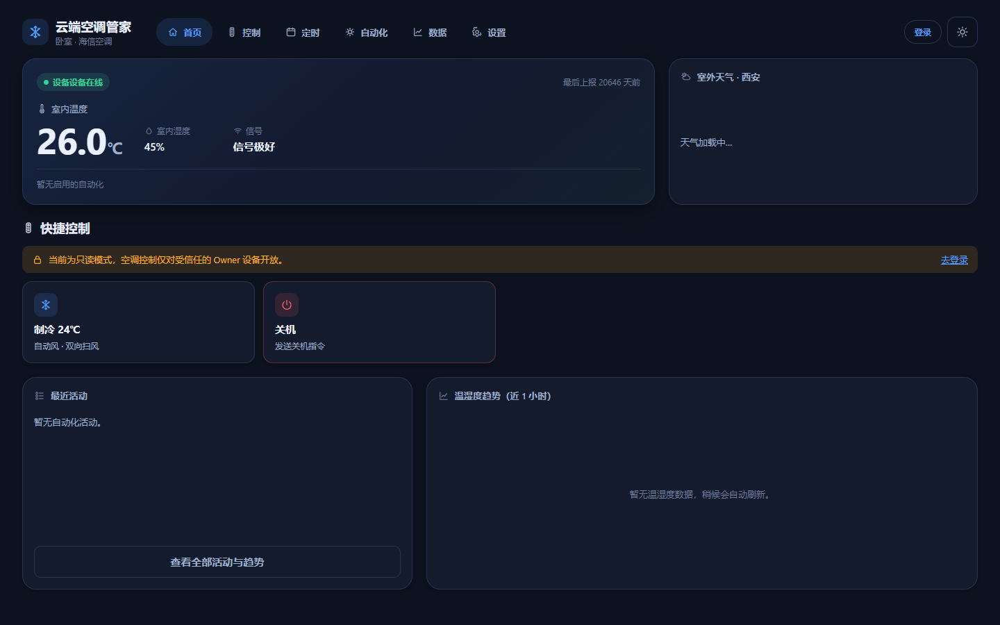
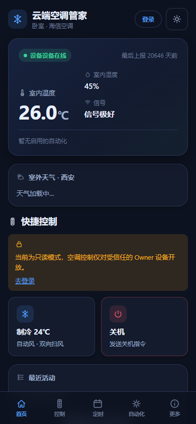

<p align="center">
  <a href="#项目简介">项目简介</a> ·
  <a href="#快速开始">快速开始</a> ·
  <a href="./docs/中文/文档导航.md">文档</a> ·
  <a href="./README.en.md">English</a>
</p>

<p align="center">
  
</p>

<h1 align="center">Remote AC Controller</h1>
<p align="center">用 ESP8266 和红外模块，把普通空调接入手机网页。</p>

<p align="center">
  <a href="https://github.com/nobodycareme/remote-ac-controller/actions/workflows/ci.yml"></a>
  <a href="https://github.com/nobodycareme/remote-ac-controller/releases"></a>
  <a href="./LICENSE"></a>
</p>

## 项目简介

这个项目源于一个直接需求：用一块 NodeMCU 控制普通红外空调，同时把固件、网页服务、PCB 和红外学习流程整理成一套可以从零搭建的方案。

## 界面预览

<table>
  <tr>
    <td width="70%"></td>
    <td width="30%"></td>
  </tr>
</table>

同一套响应式页面，支持桌面和手机访问。<sub>截图使用演示数据，仅展示界面布局。</sub>

## 核心能力

- 通过手机网页控制空调开关、模式和常用状态
- 查看 DHT11 温湿度与设备在线状态
- 设置周期定时任务
- 使用双阈值滞回温控，避免频繁启停
- 通过 MQTT 连接 ESP8266 与云端，并可选接入 Srun 校园网
- 从自己的遥控器学习红外码

## 快速开始

| 目标 | 下一步 |
|---|---|
| 只验证源码 | 无需真实凭据，运行下面的公开 PlatformIO 构建。 |
| 制作真实设备 | 按顺序阅读[接线说明](./docs/中文/接线说明.md)、[首次配置](./docs/中文/首次配置.md)和[红外学习](./docs/中文/红外学习.md)，再烧录固件。 |
| 部署完整网页控制 | 根据[部署指南](./docs/中文/部署指南.md)配置后端、前端和 MQTT，再连接设备。 |

```powershell
cd firmware/agent-platformio
./tools/dev.ps1 build -Profile public
```

公开构建会编译 WiFi 和云端模块，但不带真实凭据，也不会在开机时自动连接网络。

## 系统结构

```text
手机网页 → Fastify 后端 → MQTT → ESP8266 → 红外 → 空调
```

Vue 3 前端负责桌面和手机界面，NodeMCU ESP8266 采集传感器数据并驱动红外模块。

| 目录 | 内容 |
|---|---|
| `firmware/` | PlatformIO 与 Arduino IDE 固件工程 |
| `cloud/` | Fastify 后端、Vue 3 前端和部署配置 |
| `hardware/` | 接线、PCB 源文件与制造资料 |
| `tools/` | 红外学习工具及项目维护脚本 |
| `docs/` | 中英文使用、设计和维护文档 |

## 已验证硬件

| 类别 | 型号或修订 |
|---|---|
| 开发板 | NodeMCU ESP8266 |
| 温湿度传感器 | DHT11 |
| 红外模块 | ZJ-IR-V2 |
| PCB | Rev 1.0.1 |

使用其他开发板或红外模块时，需要重新核对引脚、电平和通信协议。

## 文档入口

| 开始使用 | 架构与协议 | 维护与排障 | 参与项目 |
|---|---|---|---|
| [首次配置](./docs/中文/首次配置.md) | [系统架构](./docs/中文/系统架构.md) | [运维指南](./docs/中文/运维指南.md) | [参与贡献](./CONTRIBUTING.md) |
| [Arduino IDE](./docs/中文/Arduino-IDE使用指南.md) | [MQTT 协议](./docs/中文/MQTT协议.md) | [故障排查](./docs/中文/故障排查.md) | [支持说明](./SUPPORT.md) |
| [部署指南](./docs/中文/部署指南.md) | [安全模型](./docs/中文/安全模型.md) | [备份与恢复](./docs/中文/备份与恢复.md) | [安全策略](./SECURITY.md) |

完整列表见[中文文档导航](./docs/中文/文档导航.md)。

## 安全与限制

<details>
<summary>搭建前需要了解的边界</summary>

- 公共仓库不含真实 WiFi、MQTT 或校园网凭据。
- 项目不提供真实空调红外码，请从自己的遥控器学习。
- 真实红外发送默认受固件安全策略限制。
- 其他开发板和红外模块可能需要适配。
- Windows 红外学习工具的 EXE 未签名。
- PCB 资料不含未经验证的 BOM 或贴片坐标。

</details>

## 贡献、支持和许可

提交改动前请阅读[贡献指南](./CONTRIBUTING.md)；使用问题和缺陷入口见[支持说明](./SUPPORT.md)。安全漏洞请通过 GitHub Private Vulnerability Reporting 提交，不要公开披露。

项目采用 [Apache License 2.0](./LICENSE)，第三方组件许可见[第三方许可说明](./docs/中文/第三方许可说明.md)。
