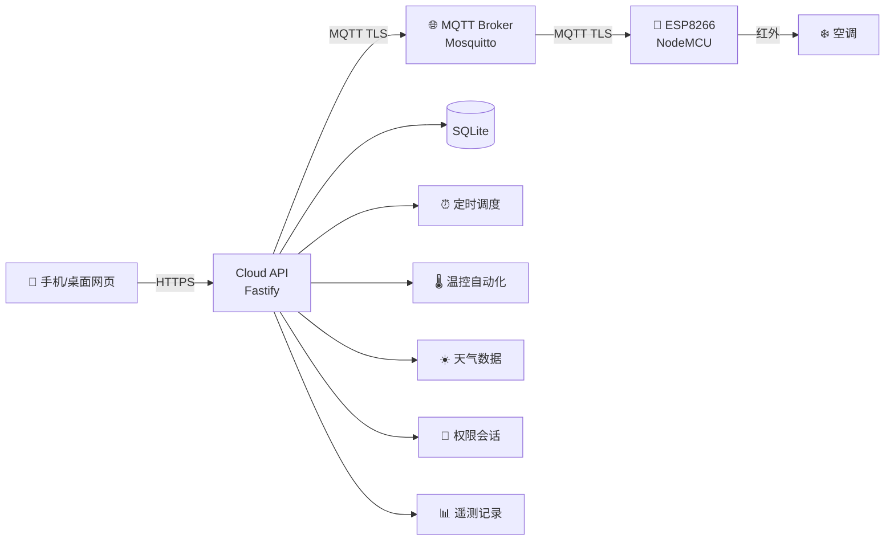

**简体中文** | [English](./docs/English/README.md)

<p align="center">
  
</p>

<h1 align="center">Remote AC Controller</h1>
<p align="center"><strong>手机远程控制空调 — 全栈开源方案</strong></p>

<p align="center">
  <a href="https://github.com/nobodycareme/remote-ac-controller/actions/workflows/ci.yml"></a>
  <a href="./LICENSE"></a>
  <a href="https://github.com/nobodycareme/remote-ac-controller/releases"></a>
  <a href="#固件两种使用方式"></a>
  <a href="#固件两种使用方式"></a>
</p>

<p align="center">
  <a href="#快速开始">快速开始</a> ·
  <a href="./docs/中文/文档导航.md">中文文档</a> ·
  <a href="./docs/English/README.md">English</a> ·
  <a href="#红外学习工具">下载工具</a> ·
  <a href="#pcb-与硬件资料">PCB 资料</a>
</p>

---

一套完整的开源远程空调控制系统：手机网页 → 云端后端 → MQTT（TLS）→ ESP8266 → 红外 → 空调。固件、云端、前端、PCB 全部开源，可自行部署。

---

## 核心能力

- **响应式远程网页控制** — Vue 3 构建的跨设备自适应界面，覆盖桌面与移动端。
- **11 个预置离散红外状态** — 覆盖关机、制冷、除湿、制热及常用温度/风速/扫风组合，每种状态独立启用。公开仓库不包含用户空调的真实红外帧，需通过[红外学习工具](./tools/ir-simple-learner/README.md)自行采集。
- **DHT11 温湿度监测** — 传感器接 GPIO5，实时上报温度与湿度。
- **定时与双阈值温控自动化** — 支持按星期掩码的周期调度任务；温控采用滞回算法，避免频繁开关机。
- **Owner / Guest 与受信任设备** — 双角色权限模型，支持持久可信会话与设备指纹识别。
- **MQTT/TLS 安全设备链路** — NodeMCU ESP8266 经加密 MQTT 与云端双向通信，凭据按用途隔离。

---

## 系统架构



---

## 快速开始

公开仓库默认配置为**安全/非生产**模式：不发真实红外、不连生产 broker、不含真实凭据。

### 固件（PlatformIO 模式）

```powershell
cd firmware/agent-platformio
pwsh ./tools/dev.ps1 test -Profile public
pwsh ./tools/dev.ps1 verify -Profile public
pwsh ./tools/dev.ps1 build -Profile public
```

### 固件（Arduino IDE 模式）

在 Arduino IDE 中打开 `firmware/arduino-ide/Remote_AC_Controller/Remote_AC_Controller.ino`，按 [`firmware/arduino-ide/README.md`](./firmware/arduino-ide/README.md) 配置开发板与依赖即可编译。

### 云端

```bash
cd cloud/backend && npm ci && npm test
cd cloud/frontend && npm ci && npm test && npm run build
```

### 统一验证

```powershell
./tools/test-all.ps1
./tools/build-all.ps1
```

---

## 固件两种使用方式

本仓库的 ESP8266 固件支持两种构建方式，共用同一套核心业务源码（`firmware/shared/RemoteACCore/`）。

| 方式 | 目录 | 适用场景 |
|---|---|---|
| **PlatformIO（Agent 自动化）** | `firmware/agent-platformio/` | CI 构建、命令行烧录、自动化部署 |
| **Arduino IDE（手动编译）** | `firmware/arduino-ide/` | Arduino IDE 2.x 手动开发与上传 |

两种方式均不内嵌生产 Wi-Fi、MQTT 凭据或真实红外数据。Agent 模式不是特定 AI 产品专用，任何自动化终端或开发人员均可使用。

---

## PCB 与硬件资料

| 资源 | 位置 |
|---|---|
| PCB 源文件（EasyEDA Pro） | [`hardware/pcb/source/`](./hardware/pcb/source/) |
| Gerber 制造文件 | [`hardware/pcb/fabrication/gerber/`](./hardware/pcb/fabrication/gerber/) |
| BOM 与坐标 | [`hardware/pcb/fabrication/`](./hardware/pcb/fabrication/) |
| PCB 文档 | [`hardware/pcb/README.md`](./hardware/pcb/README.md) |
| 制造 ZIP（嘉立创下单包） | [v1.0.0 Release 资产](https://github.com/nobodycareme/remote-ac-controller/releases) |
| 接线说明 | [`docs/中文/接线说明.md`](./docs/中文/接线说明.md) |
| 硬件说明 | [`docs/中文/硬件说明.md`](./docs/中文/硬件说明.md) |

PCB 设计与制造文件按 Apache-2.0 发布。制造 ZIP 包含完整的 Gerber、钻孔和坐标文件，可直接在嘉立创下单。

---

## 红外学习工具

本仓库提供 Windows x64 红外信号采集工具，用于从空调遥控器捕获红外帧。

| 资源 | 位置 |
|---|---|
| 源码 | [`tools/ir-simple-learner/`](./tools/ir-simple-learner/) |
| Windows EXE | [v1.0.0 Release 资产](https://github.com/nobodycareme/remote-ac-controller/releases) |
| 使用说明 | [`tools/ir-simple-learner/README.md`](./tools/ir-simple-learner/README.md) |
| 红外学习流程 | [`docs/中文/红外学习.md`](./docs/中文/红外学习.md) |

> 此 EXE 不包含任何真实空调红外帧、不包含生产凭据、不包含 TLS 私钥。使用时需配合 CH9102 USB-UART 模块接收红外接收头的信号。

---

## 仓库结构

```
remote-ac-controller/
├── firmware/
│   ├── shared/RemoteACCore/       # 共享核心业务源码
│   ├── agent-platformio/           # PlatformIO 工程（CI / 命令行）
│   └── arduino-ide/                # Arduino IDE Sketch
├── cloud/
│   ├── backend/                    # Fastify + MQTT 桥接
│   └── frontend/                   # Vue 3 网页 UI
├── hardware/
│   └── pcb/                        # PCB 源文件与制造资料
├── tools/
│   ├── ir-simple-learner/          # 红外信号采集工具
│   ├── test-all.ps1                # 全量测试
│   └── build-all.ps1               # 全量构建
├── docs/
│   ├── 中文/                        # 中文文档（21 篇）
│   └── English/                     # English documentation（20 docs）
├── .github/workflows/              # CI 工作流
├── LICENSE  NOTICE  THIRD_PARTY_NOTICES.md
└── CHANGELOG.md  CONTRIBUTING.md  SECURITY.md  SUPPORT.md
```

单次 `git clone` 即可获得全部源码，不依赖 Git 子模块。

---

## 安全与默认值

- **不含任何生产密钥**：无 Wi-Fi / MQTT 口令、无 TLS 私钥、无真实红外数据、无数据库、无生产环境文件。
- 固件与云端的公开默认值均为非生产安全值，详见 [`SECURITY.md`](./docs/中文/安全策略.md)。
- 真实红外发射受**多重独立开关**保护，全部默认关闭，且只接受 `"true"` / `"1"` 才视为开启。
- 自建者需自行准备 MQTT 凭据、TLS 证书与红外码。

---

## 文档

完整的中英文文档位于 [`docs/`](./docs)：

| 让它跑起来 | 理解它 | 运维它 |
|---|---|---|
| [硬件选型](./docs/中文/硬件说明.md) | [系统架构](./docs/中文/系统架构.md) | [部署指南](./docs/中文/部署指南.md) |
| [接线说明](./docs/中文/接线说明.md) | [MQTT 协议](./docs/中文/MQTT协议.md) | [运维指南](./docs/中文/运维指南.md) |
| [红外学习](./docs/中文/红外学习.md) | [安全模型](./docs/中文/安全模型.md) | [低配服务器部署](./docs/中文/低配置服务器部署.md) |
| | [定时任务](./docs/中文/定时任务.md) · [温控自动化](./docs/中文/温度自动控制.md) | [故障排查](./docs/中文/故障排查.md) · [备份恢复](./docs/中文/备份与恢复.md) |

---

## 环境要求

| 组件 | 要求 |
|---|---|
| Node.js | ≥ 22.5（推荐 24），使用内置 `node:sqlite` |
| 编译工具链 | 不需要。所有依赖均无原生编译 |
| 开发板 | NodeMCU / ESP8266（ESP-12E/F） |
| 服务器 | 1 GB 内存可用，构建须在本机或 CI 完成 |

---

## 已知限制

- **不含具体空调型号的真实红外码** — 需使用红外学习工具自行采集。
- **单设备模型** — 一个后端实例对应一个 `device_id`。
- **无内置监控端点** — 无 `/metrics`，监控与备份需自行接入。
- **数据库迁移无版本账本** — 升级安全，反向降级未经验证。

---

## 许可

[Apache License 2.0](./LICENSE)。中文参考译文见 [`docs/中文/Apache-2.0许可证参考译文.md`](./docs/中文/Apache-2.0许可证参考译文.md)。第三方许可见 [`THIRD_PARTY_NOTICES.md`](./THIRD_PARTY_NOTICES.md)。
