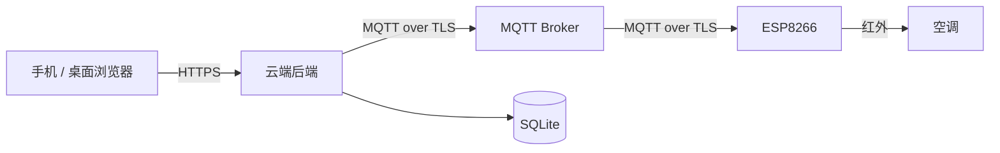

**简体中文** | [English](./README.en.md)

<p align="center">
  
</p>

<h1 align="center">Remote AC Controller</h1>
<p align="center"><strong>手机远程控制空调 — 全栈开源方案（v1.2.2）</strong></p>

<p align="center">
  <a href="https://github.com/nobodycareme/remote-ac-controller/actions/workflows/ci.yml"></a>
  <a href="./LICENSE"></a>
  <a href="https://github.com/nobodycareme/remote-ac-controller/releases"></a>
  <a href="#快速开始"></a>
  <a href="#快速开始"></a>
</p>

<p align="center">
  [快速开始](#快速开始) ·
  [中文文档](./docs/中文/文档导航.md) ·
  [English](./README.en.md) ·
  [硬件](#硬件) ·
  [文档](#文档)
</p>

---

一套完整的开源远程空调控制系统：手机网页 → 云端后端 → MQTT（TLS）→ ESP8266 → 红外 → 空调。固件、云端、前端、PCB 与红外学习工具全部开源，可自行部署、扩展与二次开发。**软件版本 v1.2.2 · PCB 修订 Rev 1.0.1。**

---

## 核心功能

- **响应式远程控制网页** — Vue 3 单页应用，桌面与手机均可使用。
- **10 组红外学习采集预设** + **11 组云端已注册空调状态元数据** — 覆盖关机、制冷、除湿、制热及常用温度/风速/摆风组合，每组可独立启用。公开仓库不包含任何真实空调红外帧，请使用[红外学习工具](#红外学习工具)采集你自己的遥控器数据。
- **温湿度监测** — DHT11 传感器（GPIO5）。
- **定时与温控自动化** — 按星期掩码的周期调度；温控采用滞回算法避免频繁启停。
- **双角色访问模型** — Owner / Guest 与受信任设备，会话持久。
- **普通家庭 WiFi 与西电校园网两种首次配置** — 通过 `ENABLE_WIFI_CREDENTIALS` 启用本地 WPA/WPA2；校园网通过 Srun Portal 自动认证（默认关闭）。
- **英文界面 / 中文文档 / 中英文全栈**。

## 仓库包含内容

| 目录 | 内容 |
|---|---|
| `firmware/` | ESP8266 固件：`agent-platformio/`（PlatformIO / command-line workflow）与 `arduino-ide/`（Arduino IDE workflow），共享同一业务核心 `shared/RemoteACCore/` |
| `cloud/` | 云端：`backend/`（Fastify + MQTT 桥接）、`frontend/`（Vue 3 Web UI）、`broker/`、`deploy/` |
| `hardware/` | PCB 设计与制造文件（Rev 1.0.1）、接线说明 |
| `tools/` | 红外学习工具、发布与校验脚本 |
| `docs/` | 完整中英文文档（见[文档](#文档)） |

## 界面预览

<p align="center">
  
</p>

<p align="center">
  
</p>

> 演示数据：设备 演示空调 / 室温 26.0℃ / 湿度 45% / 控制 制冷 24℃ 自动风 双向扫风。截图来自本地前端与合成演示数据，不包含任何真实会话或凭据。

## 快速开始

本节提供三条最常见路径；每条都对应仓库内的可执行命令。**普通 WiFi 密码**与**西电校园网账号密码**分别放在不同的 untracked secrets 文件中，二者**不可互相替代**。

### A. 普通家庭/实验室 WPA 或 WPA2 WiFi

<a id="first-time-wifi"></a>

```powershell
# 1. 准备本地凭据（只此一次）
cd firmware/shared/RemoteACCore/src/config
cp wifi_secrets.example.h wifi_secrets.h
# 编辑 wifi_secrets.h，填入路由器 SSID 与密码：
#   #define LOCAL_WIFI_SSID     "你的WiFi名称"
#   #define LOCAL_WIFI_PASSWORD "你的WiFi密码"
```

```powershell
# 2. 编译并烧录（自动连接家庭 WiFi）
cd firmware/agent-platformio
./tools/dev.ps1 build -Profile local-wifi
# 或带云连接：./tools/dev.ps1 build -Profile local-wifi-cloud
```

详细教程：[首次配置指南 — 普通 WiFi](./docs/中文/首次配置.md)

### B. 西电 Srun 校园网

<a id="first-time-campus"></a>

西电 WiFi 是开放 SSID（无 WPA 密码），**Portal 认证**用校园账号密码。

```powershell
# 1. 准备校园凭据（只此一次）
cd firmware/shared/RemoteACCore/src/config
cp profiles/xidian.example.h profiles/xidian.h
# 校园 secrets（campus_secrets.h）放 Srun 学号/密码
#   #define CAMPUS_USERNAME "你的学号"
#   #define CAMPUS_PASSWORD "你的校园网密码"
```

```powershell
# 2. 编译并烧录
cd firmware/agent-platformio
./tools/dev.ps1 build -Profile local-campus-example
```

详细教程：[首次配置指南 — 校园网](./docs/中文/首次配置.md) / [西电校园网自动认证](./docs/中文/西电校园网自动认证.md)

### C. 离线构建

<a id="first-time-offline"></a>

不配置任何凭据，只编译本地传感器 + 串口 + 安全只读功能：

```powershell
cd firmware/agent-platformio
./tools/dev.ps1 build -Profile public
# 一切走默认：ENABLE_WIFI=1 ENABLE_CLOUD=1 ENABLE_CAMPUS_AUTH=0 凭据 off
```

> 公开构建不包含任何真实凭据。`wifi_secrets.h` 与 `campus_secrets.h` 均为 git-ignored，**只提交 `.example.h`**。

### 1. 编译 ESP8266 固件（PlatformIO）

```powershell
cd firmware/agent-platformio
./tools/dev.ps1 test -Profile public
./tools/dev.ps1 verify -Profile public
./tools/dev.ps1 build -Profile public
```

详细说明：[PlatformIO 固件构建指南](./firmware/agent-platformio/README.md)

### 2. Arduino IDE workflow

用 Arduino IDE 打开 `firmware/arduino-ide/Remote_AC_Controller/Remote_AC_Controller.ino`，按 sketch 内 README 完成一次性配置后编译上传。

详细指南：[Arduino IDE 使用指南](./docs/中文/Arduino-IDE使用指南.md)

### 3. 部署 Backend 和 Frontend

```bash
cd cloud/backend && npm ci && npm test
cd cloud/frontend && npm ci && npm test && npm run build
```

完整流程（含 MQTT Broker 与 Nginx）：[部署指南](./docs/中文/部署指南.md)

### 4. 制造 PCB

使用 `hardware/pcb/fabrication/` 下的 Gerber、钻孔与飞针测试文件下单制造。制造包内容合同与逐文件校验见 [manufacturing-manifest](./hardware/pcb/fabrication/manufacturing-manifest.md)。**注意：Rev 1.0 制造文件已被取代，请勿使用。**

### 5. 使用红外学习工具

采集你自己的空调遥控器红外帧：[红外学习](./docs/中文/红外学习.md)（工具位于 [`tools/ir-simple-learner/`](./tools/ir-simple-learner/)）。下载与使用见 [Releases](https://github.com/nobodycareme/remote-ac-controller/releases) 页签中的 `IR_Simple_Learner_v4_windows_x64.exe`。

### 6. 配置可选 Srun 校园网认证

针对使用 Srun 的校园网（如西电）：[西电校园网自动认证](./docs/中文/西电校园网自动认证.md) 与 [Srun 校园网移植指南](./docs/中文/Srun校园网移植指南.md)

## 简化架构



## 硬件

- 开发板：**NodeMCU ESP8266 开发板**
- 温湿度：DHT11（GPIO5）
- 红外模块：ZJ-IR-V2（GPIO12 TX / GPIO14 RX）
- PCB：Rev 1.0.1（[PCB 文档](./hardware/pcb/README.md)，接线见[接线说明](./docs/中文/接线说明.md)）

## 可选校园网认证

针对使用 Srun 协议的校园网（例如西电），固件可在配置后于上电时自动完成 Portal 认证并在断线后自动恢复连接。该功能默认关闭；公开构建不含任何凭据。详见[西电校园网自动认证](./docs/中文/西电校园网自动认证.md)。

## 文档

完整中英文文档位于 [`docs/`](./docs)，索引见[中文文档导航](./docs/中文/文档导航.md)（英文文档在 `docs/English/` 下，成对对应）。

| 快速上手 | 理解项目 | 运维与排障 |
|---|---|---|
| [硬件说明](./docs/中文/硬件说明.md) · [接线说明](./docs/中文/接线说明.md) · [首次配置](./docs/中文/首次配置.md) | [系统架构](./docs/中文/系统架构.md) · [安全模型](./docs/中文/安全模型.md) | [部署指南](./docs/中文/部署指南.md) · [运维指南](./docs/中文/运维指南.md) |
| [Arduino-IDE使用指南](./docs/中文/Arduino-IDE使用指南.md) | [MQTT 协议](./docs/中文/MQTT协议.md) · [定时任务](./docs/中文/定时任务.md) | [故障排查](./docs/中文/故障排查.md) · [备份与恢复](./docs/中文/备份与恢复.md) |
| [红外学习](./docs/中文/红外学习.md) | [温度自动控制](./docs/中文/温度自动控制.md) | [安全策略](./SECURITY.md) · [支持说明](./docs/中文/支持说明.md) |

## Development and testing

```powershell
# 全量校验
./tools/test-all.ps1
./tools/build-all.ps1

# 文档一致性（中英对等、链接、禁用措辞）
python tools/check-doc-parity.py
python tools/check-doc-links.py
python tools/check-doc-language-links.py
python tools/check-public-docs.py

# 版本与发布完整性
python tools/check-version.py
python tools/check-pcb-release.py
```

参与开发请阅读 [参与贡献指南](./docs/中文/参与贡献.md)。

## 参与贡献

欢迎提交 Issue 与 Pull Request。请先阅读 [贡献指南](./CONTRIBUTING.md) 与[参与贡献指南](./docs/中文/参与贡献.md)。

## 支持与安全

- 使用与配置问题：先查[文档导航](./docs/中文/文档导航.md)，再开 [Issue](https://github.com/nobodycareme/remote-ac-controller/issues)。
- 安全漏洞：请使用 GitHub Private Vulnerability Reporting，不要公开提交（[安全策略](./SECURITY.md)）。

## 许可协议

本项目采用 [Apache License 2.0](./LICENSE) 许可。第三方组件许可见 [第三方组件许可声明](./THIRD_PARTY_NOTICES.md)。

## Repository 说明

本仓库是此项目**唯一正式仓库**，firmware、cloud、hardware、tools 与 docs 全部在此维护。
