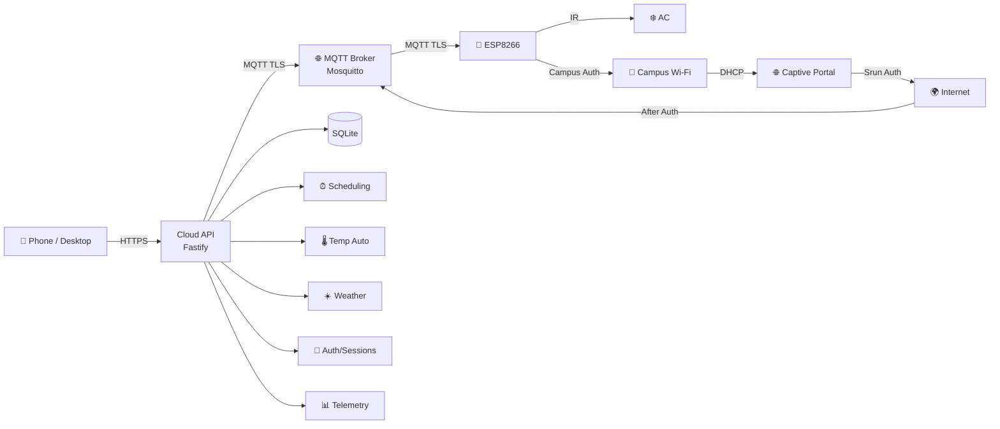

[简体中文](../中文/文档导航.md) | **English**

<p align="center">
  
</p>

<h1 align="center">Remote AC Controller</h1>
<p align="center"><strong>Full-Stack Open Source AC Remote Control</strong></p>

<p align="center">
  <a href="../../README.md">中文</a> ·
  <a href="#quick-start">Quick Start</a> ·
  <a href="#firmware-two-ways-to-build">Firmware</a> ·
  <a href="#pcb--hardware">PCB</a> ·
  <a href="#ir-learner-tool">IR Tool</a> ·
  <a href="#documentation">Documentation</a>
</p>

---

A full-stack open-source system to control an air conditioner remotely: phone
web app → cloud backend → MQTT (TLS) → ESP8266 → IR → AC. Firmware, cloud,
frontend, and PCB design files are all open source.

---

## Core Capabilities

- **Responsive remote web control** — cross-device Vue 3 UI covering desktop
  and mobile.
- **11 preset discrete IR states** — covering off, cool, dry, heat, and common
  temperature/fan/swing combinations, each independently enabled. No real AC IR
  frames are included; use the [IR learner tool](../../tools/ir-simple-learner/README.md)
  to capture your own.
- **DHT11 temperature & humidity monitoring** — sensor on GPIO5.
- **Scheduling & dual-threshold temperature automation** — weekly cron-style
  tasks; hysteresis-based temp control to prevent rapid cycling.
- **Owner / Guest with trusted devices** — dual-role access model with
  persistent trusted sessions and device fingerprinting.
- **MQTT/TLS secure device link** — encrypted MQTT between ESP8266 and the
  cloud backend, with scoped credentials.
- **Automatic Xidian campus-network authentication on ESP8266** — After joining
  the campus open SSID, the device can automatically obtain DHCP configuration,
  detect the captive portal, perform Srun authentication, verify Internet access,
  and then continue to cloud connectivity. Authentication credentials remain in
  local ignored files. **Disabled by default** — requires explicit user configuration.

---

## System Architecture



---

## Quick Start

Public repo defaults are **safe / non-production**: no real IR emission, no
production broker, no real credentials.

### Firmware (PlatformIO)

```powershell
cd firmware/agent-platformio
pwsh ./tools/dev.ps1 test -Profile public
pwsh ./tools/dev.ps1 verify -Profile public
pwsh ./tools/dev.ps1 build -Profile public
```

### Firmware (Arduino IDE)

Open `firmware/arduino-ide/Remote_AC_Controller/Remote_AC_Controller.ino`
in Arduino IDE and follow [`firmware/arduino-ide/Remote_AC_Controller/README.md`](../../firmware/arduino-ide/Remote_AC_Controller/README.md).

### Cloud

```bash
cd cloud/backend && npm ci && npm test
cd cloud/frontend && npm ci && npm test && npm run build
```

### Unified Validation

```powershell
./tools/test-all.ps1
./tools/build-all.ps1
```

---

## Firmware: Two Ways to Build

The ESP8266 firmware supports two build methods sharing the same core
business logic (`firmware/shared/RemoteACCore/`).

| Method | Directory | Use Case |
|---|---|---|
| **PlatformIO (Agent automation)** | `firmware/agent-platformio/` | CI builds, CLI flashing, automation |
| **Arduino IDE (manual)** | `firmware/arduino-ide/` | Arduino IDE 2.x development |

Neither mode embeds production Wi-Fi, MQTT credentials, or real IR data.
The Agent mode is not specific to any AI product — any automation terminal or
developer can use it.

---

## PCB & Hardware

| Resource | Location |
|---|---|
| PCB source (EasyEDA Pro) | [`hardware/pcb/source/`](../../hardware/pcb/source/) |
| Gerber fabrication files | [`hardware/pcb/fabrication/gerber/`](../../hardware/pcb/fabrication/gerber/) |
| BOM & pick-and-place | [`hardware/pcb/fabrication/`](../../hardware/pcb/fabrication/) |
| PCB documentation | [`hardware/pcb/README.md`](../../hardware/pcb/README.md) |
| Fabrication ZIP (JLCPCB pack) | [v1.0.0 Release](https://github.com/nobodycareme/remote-ac-controller/releases) |
| Wiring guide | [`docs/中文/接线说明.md`](../中文/接线说明.md) |

PCB design and fabrication files are released under Apache-2.0. The
fabrication ZIP includes complete Gerber, drill, and pick-and-place files
ready for JLCPCB ordering.

---

## IR Learner Tool

A Windows x64 utility for capturing IR signals from AC remotes via CH9102
USB-UART.

| Resource | Location |
|---|---|
| Source code | [`tools/ir-simple-learner/`](../../tools/ir-simple-learner/) |
| Windows EXE | [v1.0.0 Release](https://github.com/nobodycareme/remote-ac-controller/releases) |
| Usage guide | [`tools/ir-simple-learner/README.md`](../../tools/ir-simple-learner/README.md) |
| IR learning workflow | [`docs/中文/红外学习.md`](../中文/红外学习.md) |

> The EXE contains no real AC IR frames, no production credentials, and no TLS
> private keys. Requires a CH9102 USB-UART module connected to an IR receiver.

---

## Repository Layout

```
remote-ac-controller/
├── firmware/
│   ├── shared/RemoteACCore/       # Shared core business logic
│   ├── agent-platformio/           # PlatformIO project
│   └── arduino-ide/                # Arduino IDE sketch
├── cloud/
│   ├── backend/                    # Fastify + MQTT bridge
│   └── frontend/                   # Vue 3 web UI
├── hardware/
│   └── pcb/                        # PCB source & fabrication files
├── tools/
│   ├── ir-simple-learner/          # IR learning utility
│   ├── test-all.ps1
│   └── build-all.ps1
├── docs/
│   ├── 中文/                        # Chinese docs (21)
│   └── English/                     # English docs (20)
├── .github/workflows/              # CI workflows
├── LICENSE  NOTICE  THIRD_PARTY_NOTICES.md
└── CHANGELOG.md  CONTRIBUTING.md  SECURITY.md  SUPPORT.md
```

No Git submodules — a single `git clone` gives you everything.

---

## Security & Safe Defaults

- **No production secrets**: no Wi-Fi/MQTT passwords, no TLS private keys,
  no real IR data, no databases.
- Public firmware/cloud defaults are non-production safe.
- Real IR emission is protected by multiple independent kill switches, all
  defaulting to off.
- See [`SECURITY.md`](./security.md) for the security policy.

---

## Documentation

Full bilingual documentation in [`docs/`](../):

| Getting Started | Understanding | Operations |
|---|---|---|
| [Architecture](../中文/系统架构.md) | [MQTT Protocol](../中文/MQTT协议.md) | [Deployment](../中文/部署指南.md) |
| [Hardware](../中文/硬件说明.md) | [Security Model](../中文/安全模型.md) | [Ops Guide](../中文/运维指南.md) |
| [Wiring](../中文/接线说明.md) | [Scheduling](../中文/定时任务.md) | [Troubleshooting](../中文/故障排查.md) |
| [IR Learning](../中文/红外学习.md) | [Temp Automation](../中文/温度自动控制.md) | [Backup & Recovery](../中文/备份与恢复.md) |
| [Arduino IDE Guide](./arduino-ide-guide.md) | [Xidian Campus Auth](./xidian-campus-network-authentication.md) | |
| | [Srun Porting Guide](./srun-campus-network-porting-guide.md) | |

---

## Requirements

| Component | Requirement |
|---|---|
| Node.js | ≥ 22.5 (24 recommended), uses built-in `node:sqlite` |
| Toolchain | None — all dependencies are pure JS / built-in |
| Board | NodeMCU / ESP8266 (ESP-12E/F) |
| Host | 1 GB RAM workable; build off-host |

---

## Known Limitations

- **No real AC IR frames included** — capture your own using the learner tool.
- **Single-device model** — one backend instance per `device_id`.
- **No built-in /metrics endpoint** — add your own monitoring.
- **Database migration lacks version ledger** — upgrades are safe; downgrades
  untested.

---

## License

[Apache License 2.0](../../LICENSE). Third-party notices: [`THIRD_PARTY_NOTICES.md`](../../THIRD_PARTY_NOTICES.md).
